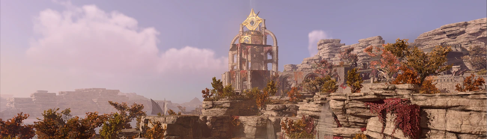

# Act Two Expansion — русская локализация

Русский перевод мода [Act Two Expansion - Custom Campaign](https://www.nexusmods.com/baldursgate3)
для Baldur's Gate 3 — отдельный мод-патч, который не трогает файлы оригинала.

| | |
|---|---|
| Версия оригинала | **0.8** |
| Строк в моде | 4987 |
| Переведено | **4513 (90.5%)** |
| Технические строки | 454 — отладочные метки и пустые записи, переводу не подлежат |
| Требуют уточнения | 3 |

Переведён весь игровой текст мода. Оставшиеся 9% строк — служебные метки
редактора, подсказки ИИ и записи с пустым оригиналом: они никогда не
показываются игроку. Ещё три строки помечены `needs_context` — в них
из текста не восстановить род говорящего или смысл, и они намеренно
оставлены английскими, а не переведены наугад.

## Установка

1. Скачайте `.pak` из раздела [Releases](../../releases).
2. Положите его в `%LOCALAPPDATA%\Larian Studios\Baldur's Gate 3\Mods`.
3. Включите мод в менеджере модов **после** оригинального Act Two Expansion.
4. Язык игры — русский.

Мод-перевод объявляет оригинал своей зависимостью, поэтому в списке загрузки
он встанет после него. Привязки к конкретной сборке оригинала нет: обновление
самого Act Two Expansion перевод не ломает, но новые строки в нём до
следующего обновления перевода останутся английскими.

## Что лежит в репозитории

| Путь | Что это |
|---|---|
| `data/translations.jsonl` | сам перевод: оригинал, перевод, статус и история каждой строки |
| `data/source.en.jsonl` | снимок английского текста текущей версии оригинала |
| `data/batches/` | рабочие порции, на которые разбит перевод |
| `glossary/glossary.csv` | согласованная терминология |
| `glossary/style-guide.md` | правила оформления |
| `reports/` | отчёты о сверке с новой версией оригинала и о контроле качества |

Одна строка `data/translations.jsonl` выглядит так:

```json
{"contentuid": "h89f381c6g72dbgab82ga7aag03b367f2ae61", "version": 1,
 "source": "Pile of Stained Towels", "target": "Стопка запачканных полотенец",
 "status": "approved", "notes": "", "first_seen": "0.8", "last_seen": "0.8"}
```

### Статусы строк

| Статус | Значение | В сборке |
|---|---|---|
| `approved` | вычитан | **да** |
| `untranslated` | очередь ещё не дошла | нет |
| `needs_review` | английский текст изменился в новой версии оригинала | нет |
| `needs_context` | из текста не восстановить род говорящего или смысл | нет |
| `do_not_translate` | отладочная строка автора мода, переводу не подлежит | нет |
| `obsolete` | строки больше нет в оригинале, перевод сохранён на случай возврата |  нет |

Перевод переживает обновления оригинала: при выходе новой версии строки
сверяются по `contentuid`, изменившиеся отправляются на вычитку с сохранением
прежнего варианта, исчезнувшие не удаляются.

## Принципы перевода

- Терминология сверяется с официальной русской локализацией Baldur's Gate 3
  и правилами D&D 5e: *Long Rest* — «Долгий отдых», *Saving Throw* —
  «спасбросок», *Shadow-Cursed Lands* — «Оскверненные тенью земли».
- Игровая разметка (`<LSTag>`, `<br>`) и подстановки (`[1]`, `{0}`)
  сохраняются без изменений вместе с атрибутами — это проверяется
  автоматически перед каждой сборкой.
- Идентификаторы строк (`contentuid`, `version`) никогда не меняются.
- Если из текста не определить род персонажа или смысл строки неоднозначен,
  строка помечается `needs_context` и остаётся английской, а не переводится
  наугад.

## Обратная связь

Нашли неточность в переводе — откройте
[issue](../../issues) и укажите `contentuid` строки или её английский текст.

---

Перевод распространяется отдельно от оригинального мода; все права на сам мод
и его содержимое принадлежат его автору (SquallyDaBeanz).
